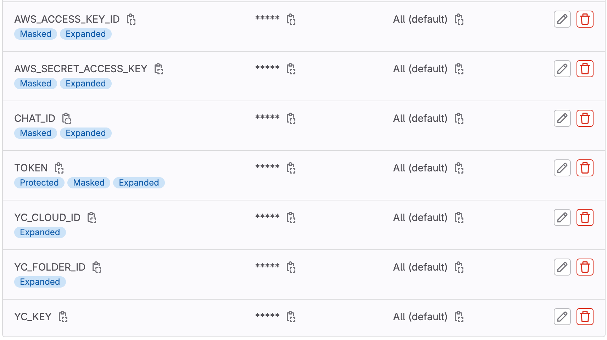

# infra-terraform

Настройка хранения state-файла terraform на удалённом бэкенде для управления инфраструктурой через Gitlab при работе в команде.

Краткое описание процесса.

**Подготовим инфраструктуру:**
- s3-bucket для хранения и версионирования state-файла,
- YDB-базу для блокировки state-файла,
- бэкэнд для будущей инфраструктуры,
- VM для GitLab Runner,
- ключи доступа.

**Настроим GitLab:**
- создадим проект
- пропишем секретные ключи в переменные
- настроим аллерты в Telegram
- создадим и установим GitLab Runner


## Подготовка инфраструктуры

- Клонируем проект `git clone https://github.com/andryplekhanov/infra-terraform.git`
- Заходим в директорию **backend**: `cd infra-terraform/backend`
- Инициализируем terraform `terraform init`
- Экспортируем переменные окружения:

```
export YC_TOKEN=<your_token>
export YC_CLOUD_ID=<your_cloud_id>
export YC_FOLDER_ID=<your_folder_id>
export AWS_ACCESS_KEY_ID="mock_access_key"
export AWS_SECRET_ACCESS_KEY="mock_secret_key"
```

- Применяем манифесты: `terraform apply -var name=<unique_s3-bucket_name>`
- Получаем результат в консоли, копируем его и сохраняем в `infra-terraform/gitlab-infra/backend.tf`:

```
terraform {
  backend "s3" {
    region         = "ru-central1"
    bucket         = "andreiplekhanov6nw2crq100"
    key            = "terraform.tfstate"

    dynamodb_table = "state-lock-table"

    endpoints = {
      s3       = "https://storage.yandexcloud.net",
      dynamodb = "https://docapi.serverless.yandexcloud.net/ru-central1/b1gdtu6fru13qselq36d/etnftcf4hjpgm4eglub4"
    }

    skip_credentials_validation = true
    skip_region_validation      = true
    skip_requesting_account_id  = true
    skip_s3_checksum            = true
  }
}
```


## Создание проекта в GitLab и регистрация GitLab Runner

- Перенесите в директорию `infra-terraform/gitlab-infra` свои terraform-манифесты
- Создайте проект на GitLab
- Внутри проекта перейдите в **Settings → CI/CD → Variables** и добавьте:
  - **AWS_ACCESS_KEY_ID** — статический ключ доступа для удалённого бэкенда из файла `infra-terraform/backend/.env`.
  - **AWS_SECRET_ACCESS_KEY** — статический ключ доступа для удалённого бэкенда из файла `infra-terraform/backend/.env`.
  - **YC_CLOUD_ID** — ID облака.
  - **YC_FOLDER_ID** — ID директории, где будут создаваться ресурсы.
  - **YC_KEY** — ключ доступа для Terraform, который вы получили ранее из файла `infra-terraform/backend/.key.json`.

- Для уведомлений в Telegram:
  - создайте бота через **@BotFather**, запишите токен
  - узнайте свой **chat ID** через **@getmyid_bot**, запишите его
  - создайте еще 2 переменные **TOKEN** и **CHAT_ID** и присвойте им полученные ранее значения



- Создайте и подключите GitLab Runner:
  - Внутри проекта перейдите **Settings → CI/CD → Runners → New Project Runner**, укажите **Run untagged jobs**, нажмите **Create runner** и скопируйте строку для регистрации GitLab Runner.
  - Подключитесь по SSH к ранее созданному инстансу **gitlab-runner** `ssh -i ~/.ssh/id_rsa ubuntu@<Внешний IP>` и повысьте права до рута `sudo su -`
  - Выполните строку регистрации, которую скопировали из шага выше (тип GitLab Runner: **shell**)
- Запушьте в проект содержимое директории `infra-terraform/gitlab-infra`


## Управление инфраструктурой и командная работа

1. После пуша ваших манифестов в проект на GitLab автоматически запустятся джобы **validate** и **plan**.
2. Джобы **apply** и **destroy** запускаются только из ветки **main** и только вручную после успешного выполнения предыдущих джоб.
3. Запуск джобы **apply** развернёт всю инфраструктуру.
4. Запуск джобы **destroy** удалит всю инфраструктуру.
5. В ветках работают только джобы **validate** и **plan**.
